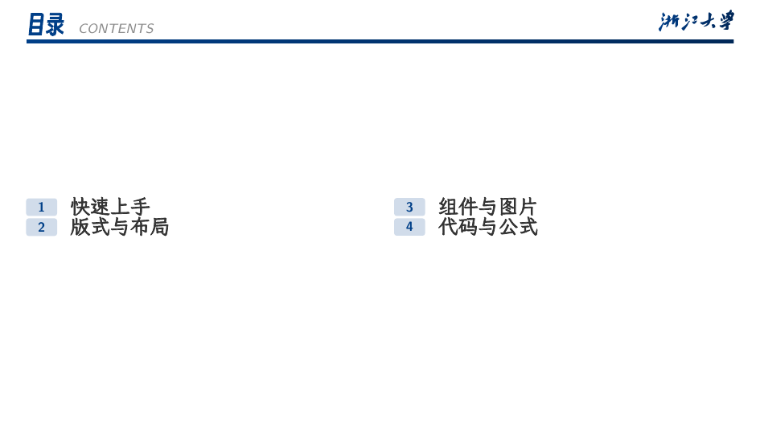
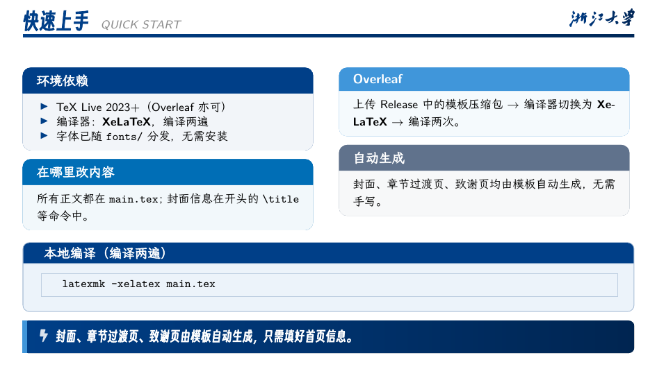
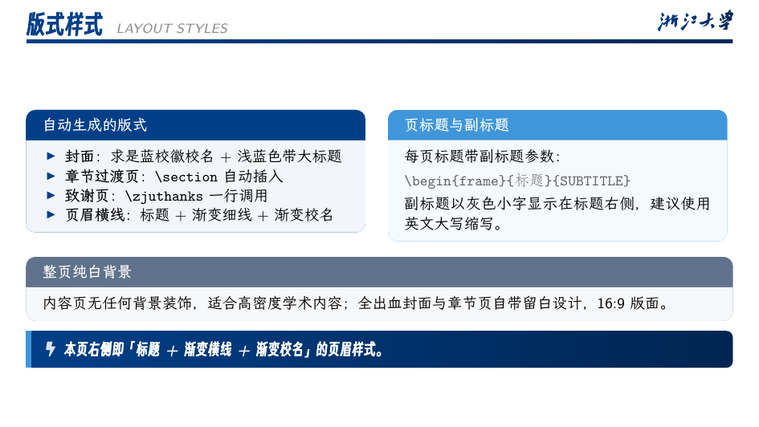
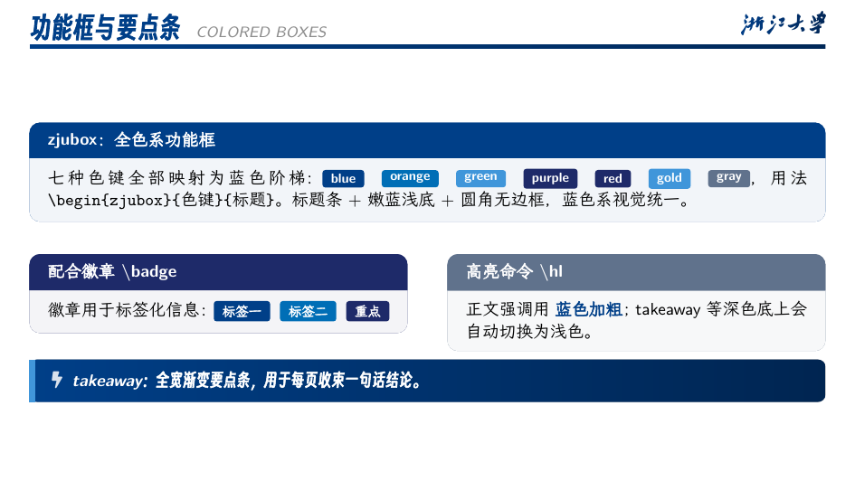
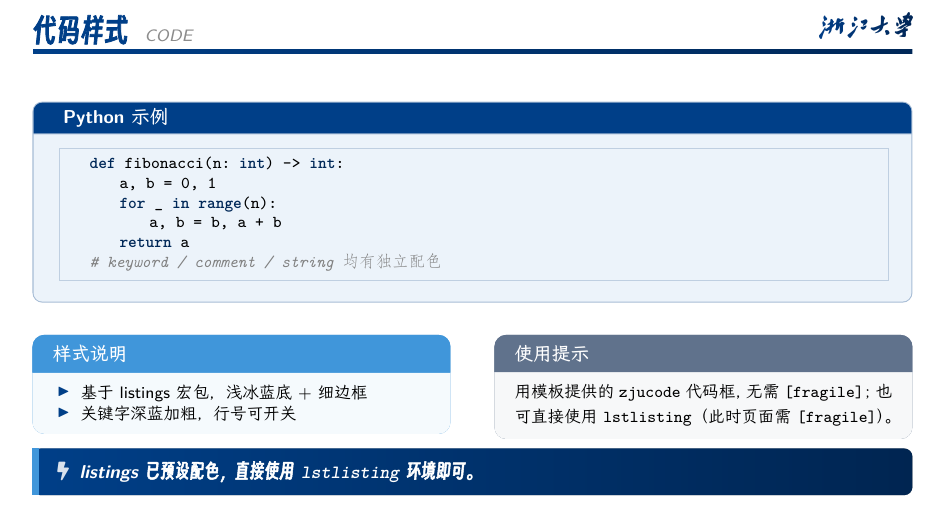
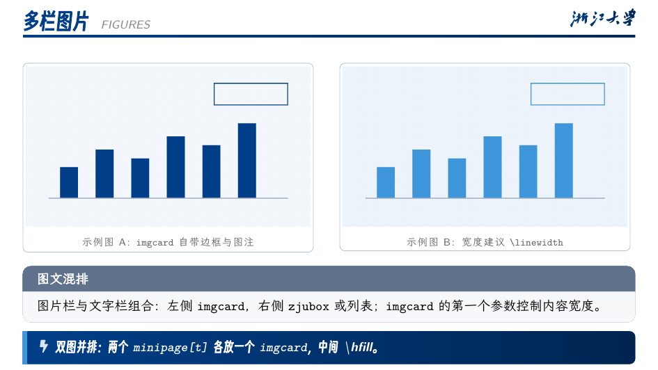

# ZJU Beamer Template（zju_beamer_pro）

浙江大学风格的学术演示 Beamer 模板：白底简洁版式 + 求是蓝配色 + 高信息密度组件。
中文使用**得意黑**、正文使用**霞鹜文楷**、西文使用 **Fira Sans**，编译即所得，Overleaf 可直接使用。

> 特点：封面 / 目录 / 章节过渡页 / 致谢页自动生成；预定义功能框、要点条、数据卡片、
> 时间线、徽章、图片卡片等组件；蓝色阶梯配色；代码与公式样式开箱即用。

## 功能特性

- **自动版式**：封面、目录、章节过渡页（`\section` 自动插入）、致谢页一键调用
- **页眉样式**：蓝色标题 + 求是蓝→深蓝渐变细线，右上角渐变校名字标
- **预定义组件**：
  - `zjubox`：七色功能框（色键 `blue/orange/green/purple/red/gold/gray`，全部为蓝色阶梯）
  - `takeaway`：全宽渐变要点条
  - `statcard`：数据卡片（支持 `\hfill` 并排）
  - `awardcard`：奖项卡片
  - `zjutimeline` + `\titem`：时间线
  - `\badge`：徽章；`\hl`：正文高亮；`zjucode`：代码演示框
- **代码与公式**：listings 预设配色；数学字体衬线（`onlymath`），公式开箱即用
- **多栏布局**：`minipage[t]` 自由分栏（模板内含顶部对齐细节处理）

## 依赖

| 依赖 | 说明 |
|---|---|
| TeX Live 2023+ / Overleaf | 编译器必须为 **XeLaTeX** |
| 宏包 | `ctex`、`xeCJK`、`fontspec`、`tikz`、`pgfplots`、`tcolorbox`、`fontawesome5`、`booktabs`、`listings`、`Fira`（TeX Live 包名 `fira`，Overleaf 自带） |
| 中文字体 | **得意黑 Smiley Sans**、**霞鹜文楷 LXGW WenKai**（均为 OFL 许可，已随仓库 `fonts/` 目录分发，无需安装） |
| 西文字体 | Fira Sans（由 TeX Live 的 `fira` 宏包提供；缺失时自动回退 Latin Modern Sans） |

## 使用流程

### Overleaf

1. 从本仓库 **Releases** 下载预打包的 `ZJU_Beamer_Template.zip`（含全部字体与图片）。
2. Overleaf → New Project → **Upload Project** 上传该 zip。
3. 左上角 Menu → Compiler 改为 **XeLaTeX** → Recompile（建议编译两次，更新目录）。

### 本地编译

```bash
latexmk -xelatex main.tex   # 执行两次以更新目录
# 或
make
```

## 正文在哪里改

所有内容都在 `main.tex`：

| 位置 | 内容 |
|---|---|
| 文件开头 `\title` / `\subtitle` / `\author` / `\institute` / `\date` | 封面信息 |
| `\section{...}` | 章节（自动生成过渡页与目录） |
| 各 `\begin{frame}...` | 每一页正文，组件用法参考对应演示页源码 |
| `zju_beamer_pro.sty` | 配色、字体、组件样式（一般无需改动） |

> 致谢页署名：在 `main.tex` 导言区 `\renewcommand{\zjuthanksinfo}{你的姓名 · 院系 · 日期}` 即可定制。

## 目录结构

```
.
├── main.tex              # 演示文档（在此修改内容）
├── zju_beamer_pro.sty    # 模板主题
├── figures/              # 校徽校名与演示图片
├── fonts/                # 得意黑、霞鹜文楷（OFL 许可，随模板分发）
├── screenshots/          # README 截图
├── Makefile
└── ZJU_Beamer_Template.pdf  # 编译好的模板 PDF
```

## 致谢

本模板在设计过程中参考了以下优秀的开源项目与作品：

- [qychen2001/ZJU-Beamer-Template](https://github.com/qychen2001/ZJU-Beamer-Template) —— 本模板的上游基础
- [TonyCrane 的系统课 slides](https://slides.tonycrane.cc/) —— 版式层级与字体搭配（霞鹜文楷 + 黑体标题）的参考
- [SimplePlus Beamer Theme](https://github.com/pm25/SimplePlus-BeamerTheme) —— 简洁横线页眉与嫩色 block 风格的参考
- 字体：[得意黑 Smiley Sans](https://github.com/atelier-anchor/smiley-sans)、[霞鹜文楷 LXGW WenKai](https://github.com/lxgw/LxgwWenKai)（均遵循 SIL OFL 许可）

## 许可

模板代码沿用上游的 LPPL 1.3c / GPL 3.0 双许可；`fonts/` 目录中的字体遵循各自的开源许可（SIL OFL）。

---

## 模板预览

### 封面


### 目录与章节过渡页




### 快速上手



### 多栏布局



### 功能框与要点条



### 数据卡片与时间线


### 代码样式



### 公式样式



### 多栏图片


### 致谢页


